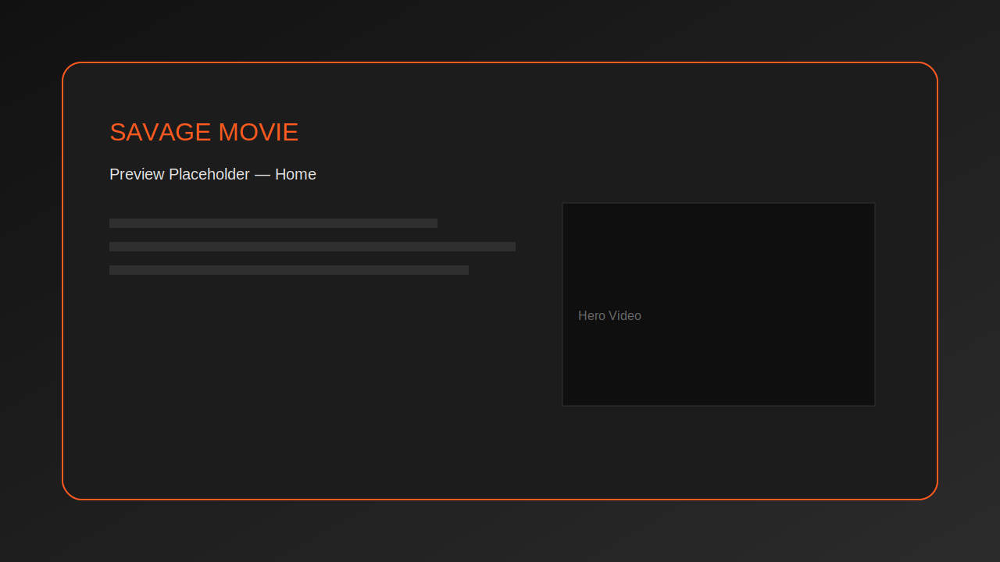
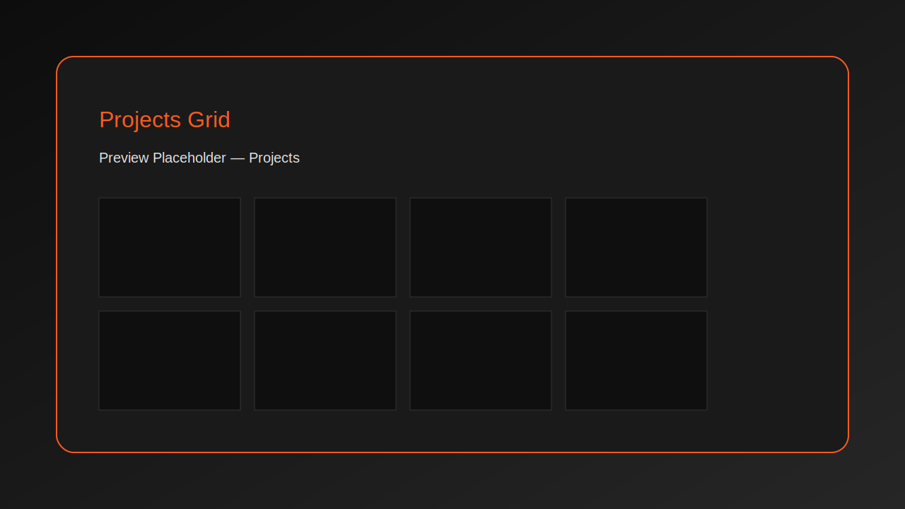
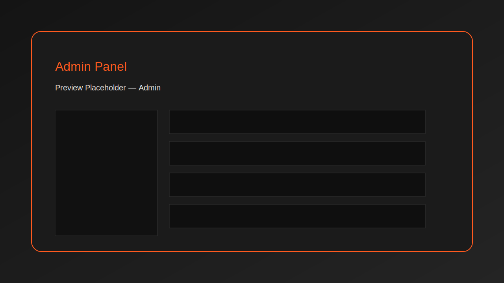

<a id="readme"></a>

<div align="center">


# SAVAGE MOVIE
### Премиальный сайт‑портфолио видеографа и продюсера

Публичный сайт + блог + курсы + бронирование + админ‑панель + платежи + интеграции.
<br/>
**Stack:** Next.js 16 + FastAPI + PostgreSQL + Docker

<p align="center">
  
  
  
  
  
  
</p>

<p align="center">
  <a href="https://github.com/DaneliyaPavel/savage-movie/actions/workflows/deploy.yml">
    
  </a>
  
  
  <a href="https://github.com/DaneliyaPavel/savage-movie/actions/workflows/deploy.yml">
    
  </a>
  
  
</p>

</div>

---

<div align="center">
  <table>
    <tr>
      <td align="center"><b>README</b></td>
      <td align="center"><a href="DOCKER_SETUP.md">Docker</a></td>
      <td align="center"><a href="DEPLOY_VDS.md">Deploy VDS</a></td>
      <td align="center"><a href="backend/README.md">Backend API</a></td>
      <td align="center"><a href="ARCHITECTURE.md">Architecture</a></td>
      <td align="center"><a href="PROJECT_STRUCTURE.md">Structure</a></td>
      <td align="center"><a href="MIGRATION_INSTRUCTIONS.md">Migrations</a></td>
      <td align="center"><a href="UPLOAD_GUIDE.md">Uploads</a></td>
      <td align="center"><a href="DATA_RECOVERY_GUIDE.md">Recovery</a></td>
    </tr>
  </table>
</div>

---

## ✨ Что внутри

<table>
  <tr>
    <td>🎬 Видео‑портфолио</td>
    <td>Проекты с Mux и кастомными плеерами</td>
  </tr>
  <tr>
    <td>🧠 Курсы</td>
    <td>Покупка, прогресс, просмотр уроков</td>
  </tr>
  <tr>
    <td>📅 Бронирование</td>
    <td>Calendly для записи на услуги</td>
  </tr>
  <tr>
    <td>🧩 Админ‑панель</td>
    <td>CRUD для проектов, курсов, клиентов, отзывов</td>
  </tr>
  <tr>
    <td>💳 Оплата</td>
    <td>YooKassa + webhook обработка</td>
  </tr>
  <tr>
    <td>🔐 Аутентификация</td>
    <td>JWT + OAuth (Google, Yandex)</td>
  </tr>
</table>

---

## 🎞️ Превью

<table>
  <tr>
    <td></td>
    <td></td>
  </tr>
  <tr>
    <td colspan="2"></td>
  </tr>
</table>

> Замените изображения в `docs/assets/` на реальные скриншоты, сохранив имена файлов.

---

## 🚀 Быстрый старт

### Вариант A — Docker (рекомендуется)

```bash
# 1) Клонировать репозиторий
git clone <repository-url>
cd savage-movie

# 2) Подготовить env
cp .env.example .env

# 3) Запуск
./scripts/init-docker.sh
# или быстрый запуск
./docker-start.sh
```

### Вариант B — Локально без Docker

```bash
# Frontend
npm install
cp .env.example .env.local
npm run dev

# Backend
cd backend
pip install -r requirements.txt
alembic -c alembic.ini upgrade head
uvicorn app.main:app --reload --host 0.0.0.0 --port 8000
```

**Адреса после запуска (Docker):**
- Frontend: http://localhost:3000
- Backend API: http://localhost:8001
- API Docs: http://localhost:8001/docs
- Admin: http://localhost:3000/admin

**Если backend запущен локально без Docker:** `http://localhost:8000` и `http://localhost:8000/docs`

---

## 🧭 Навигация по проекту

```text
savage-movie/
├── app/                  # Next.js App Router (маршруты)
├── components/           # UI/sections/admin компоненты
├── features/             # Доменные фичи (projects/courses)
├── lib/                  # API клиенты, интеграции, env
├── backend/              # FastAPI + Alembic + SQLAlchemy
├── infra/                # Nginx/Let's Encrypt
├── scripts/              # Docker/backup/ops скрипты
└── docker-compose.yml
```

Подробная структура: `PROJECT_STRUCTURE.md`.

---

## 🔐 Создание администратора

```bash
./scripts/create-admin.sh admin@example.com your_password
```

Альтернатива — auto‑seed через `.env`:

```env
SEED_ADMIN=true
SEED_ADMIN_EMAIL=admin@example.com
SEED_ADMIN_PASSWORD=your_password
SEED_ADMIN_FORCE_PASSWORD=false
```

---

## 🧪 Скрипты и команды

<details>
  <summary><b>Frontend (npm)</b></summary>

```bash
npm run dev          # dev сервер
npm run build        # production build
npm run lint         # ESLint
npm run type-check   # TypeScript
npm run test         # Vitest
npm run format       # Prettier
```
</details>

<details>
  <summary><b>Docker</b></summary>

```bash
./scripts/init-docker.sh   # базовая инициализация
./docker-start.sh          # быстрый старт
./scripts/docker-dev.sh    # меню: restart/rebuild
./up                       # прод‑запуск (см. DEPLOY_VDS.md)
```
</details>

<details>
  <summary><b>Бэкапы</b></summary>

```bash
./scripts/backup.sh
./scripts/restore.sh backups/<backup_dir>
```
</details>

---

## 🧩 Технологии

**Frontend:** Next.js 16, React 19, TypeScript, Tailwind CSS 4, Radix UI, Shadcn/UI, Framer Motion, Embla, Zod

**Backend:** FastAPI, SQLAlchemy (async), Alembic, PostgreSQL

**Интеграции:** YooKassa, Mux, Resend, Calendly, OAuth Google/Yandex

---

## 📚 Документация

- `DOCKER_SETUP.md` — Docker‑развертывание
- `DEPLOY_VDS.md` — деплой на VDS
- `backend/README.md` — backend API и деплой
- `ARCHITECTURE.md` — архитектура и потоки запросов
- `PROJECT_STRUCTURE.md` — структура проекта
- `MIGRATION_INSTRUCTIONS.md` — Alembic миграции
- `UPLOAD_GUIDE.md` — загрузка файлов
- `DATA_RECOVERY_GUIDE.md` — восстановление данных

---

## 📄 Лицензия

Private (все права защищены)
